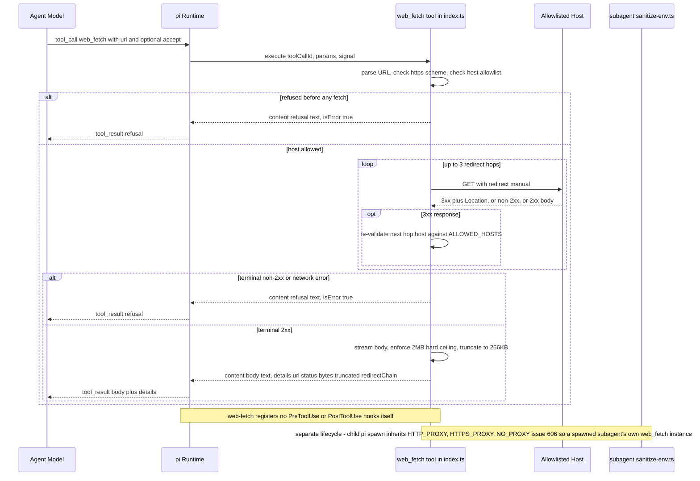
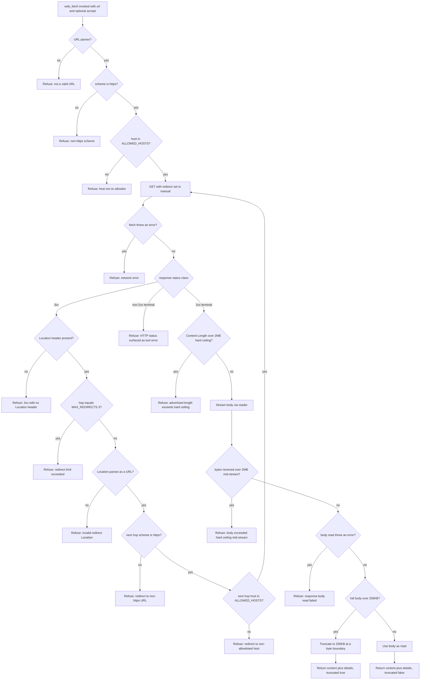
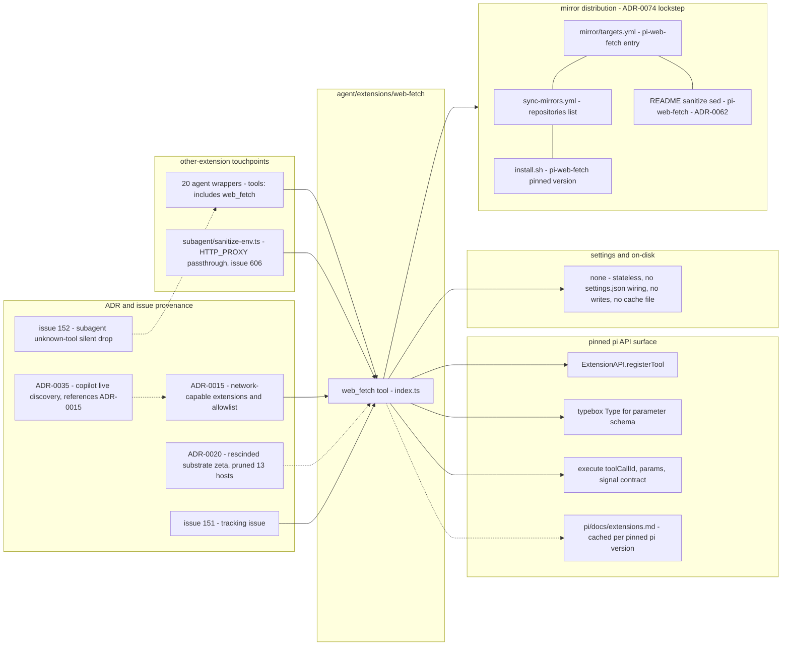

# web-fetch — pi extension

> **First-party** to this repo. Registers the `web_fetch` tool used by research-specialist subagents to corroborate findings against authoritative first-party documentation.

## Install

```sh
pi install git:github.com/psmfd/pi-web-fetch
```

Try it first without installing: `pi -e git:github.com/psmfd/pi-web-fetch`.

> The `pi install` / `pi -e` commands above track the mirror's default branch (unpinned). The pi_config consumer bootstrap (`install.sh`) instead pins an exact tagged mirror release (per the ADR-0074 lockstep) — the two paths are not assumed equivalent.

## Purpose

The research-specialist subagents that list `web_fetch` in their `tools:` frontmatter — the full consumer set is the header comment in `index.ts` (currently 20 agents: `security-review-expert`, `code-review-expert`, `shell-expert`, the cloud and infra specialists, language specialists, container/orchestration specialists, `docs-expert`, `pi-agent-expert`, plus `checkmarx-expert`, `gh-cli-expert`, `gitflow-expert`, and `linter`) — claim in their descriptions that they cite first-party documentation. Prior to this extension they could not: at the time ADR-0015 was authored, pi 0.75.4 shipped only `read`, `bash`, `edit`, `write` built-ins, and the bare `web` tool listed in those wrappers' `tools:` frontmatter was a silent no-op (root cause tracked in #152). The result was opus-pinned reviewers citing from cached model knowledge and flagging claims as "not corroborated" when challenged.

`web_fetch(url, accept?)` performs an HTTPS GET against an operator-curated allowlist of first-party documentation hosts and returns the response body (≤256 KB). It is read-only, requires no credentials, and is the only **agent-invokable** network tool in `agent/extensions/` — the `shared/` model-discovery probes (`copilot-discovery.ts`, `anthropic-discovery.ts`) make their own host-pinned first-party API calls in extension source, outside this allowlist's scope by design ([ADR-0035](https://github.com/psmfd/pi-config/blob/main/adrs/0035-copilot-live-model-discovery.md)).

Tracking issue: #151. Substrate decision: [ADR-0015](https://github.com/psmfd/pi-config/blob/main/adrs/0015-network-capable-extensions-and-the-first-party-docs-allowlist.md).

## Security boundary

The single security boundary is the **host allowlist** in `index.ts` (the `ALLOWED_HOSTS` set). The threat model assumes:

- The agent's reasoning can be steered by adversarial content in any file or tool output it reads (prompt injection).
- An attacker who can steer reasoning will try to drive the agent to fetch arbitrary URLs (SSRF, data exfiltration to attacker-controlled hosts, credential probing of internal endpoints).
- The defense is operator-curated host selection at allowlist-edit time: an attacker cannot add a host without a reviewed PR.

This is a defense-in-depth posture, not perimeter security. Subordinate enforcement:

| Rule | Enforcement |
|---|---|
| URL scheme must be `https:` | Hard refusal — refuses `http:`, `file:`, `data:`, anything else |
| URL host must be in `ALLOWED_HOSTS` | Hard refusal |
| 3xx redirects must each land on an allowlisted host | Hard refusal at the offending hop; max 3 hops total. Defeats open-redirector bypass on otherwise-allowlisted hosts. |
| Response body >256 KB | Truncated to 256 KB (not refused); truncation is reported in the tool result `details` |
| Non-2xx terminal response | Returned as tool error with status code |

No `SKIP_*` env override exists. Adding a host requires a PR.

### Request lifecycle



## Refusal policy (per-rule)

| Rule | Mode |
|---|---|
| Input URL fails to parse | Hard refusal |
| Non-`https:` scheme | Hard refusal |
| Host not on allowlist | Hard refusal |
| Redirect to non-allowlisted host | Hard refusal |
| Redirect to non-`https:` URL | Hard refusal |
| Redirect 3xx with missing or unparseable `Location` header | Hard refusal |
| Redirect chain longer than 3 hops | Hard refusal |
| Non-2xx terminal response | Hard refusal (surfaced with HTTP status) |
| Body exceeds 256 KB | Continue-eligible (truncate + report in `details.truncated`) |
| Response advertises `Content-Length` > 2 MB (8× cap) | Hard refusal — defense-in-depth against runaway allocations |
| Response body exceeds 2 MB mid-stream (no Content-Length or server lied) | Hard refusal at the streaming-read layer |
| Network error (DNS, connect, TLS) | Hard refusal (surfaced with error message) |

The full decision flow — every refusal branch plus the body-handling ceilings — in one place:



## Allowlist

The full list lives in `index.ts` `ALLOWED_HOSTS`. Coverage matrix at the time of authoring:

| Domain | Hosts | Covers |
|---|---|---|
| ADR | `adr.github.io` | MADR template — canonical reference for our `adr-required` rule |
| Ansible | `docs.ansible.com` | `ansible-expert` |
| Anthropic | `docs.anthropic.com`, `docs.claude.com` | Claude Code installer + model docs; mid-migration between the two hosts, both kept live during the transition |
| Apple | `developer.apple.com` | macOS, Swift, Xcode |
| Astral | `docs.astral.sh` | Ruff (linter) + uv (package manager) |
| AWS | `docs.aws.amazon.com` | `aws-expert` |
| AWS re:Post | `repost.aws` | Vendor-operated Q&A forum (replaces AWS Developer Forums) |
| Checkmarx | `docs.checkmarx.com` | `checkmarx-expert` |
| Conventional Commits | `www.conventionalcommits.org` | Spec referenced by the `conventional-commits` rule |
| CVE | `www.cve.org` | MITRE-operated CVE catalog — `security-review-expert` |
| Docker | `docs.docker.com` | `docker-expert` |
| .NET | `dotnet.microsoft.com` | Release/SDK/lifecycle metadata (prose docs at `learn.microsoft.com`) — `dotnet-expert` |
| ESLint | `eslint.org` | Rule reference + flat-config docs — `linter`, TS extension tooling |
| freedesktop | `freedesktop.org`, `specifications.freedesktop.org`, `www.freedesktop.org` | XDG, systemd-adjacent, Wayland |
| Git | `git-scm.com` | Canonical `git` / `git-config` docs — `gitflow-expert` |
| GitHub | `cli.github.com`, `docs.github.com`, `github.com`, `raw.githubusercontent.com` | upstream pi, ADRs in the wild, source citation, REST API / Actions / branch-protection / GHCR / fine-grained PAT docs (`docs.github.com`), `gh` CLI reference (`cli.github.com`). **High user-content surface — see note below.** |
| GNU | `gnu.org`, `www.gnu.org` | Bash, coreutils, glibc |
| Google Cloud | `cloud.google.com` | (no GCP specialist yet, but referenced in cross-cloud discussions) |
| Helm | `helm.sh` | `helm-expert` |
| Hugging Face | `huggingface.co` | Model cards, tensor/tokenizer metadata for local-inference planning. **High user-content surface — see note below.** |
| IETF | `datatracker.ietf.org`, `www.rfc-editor.org` | RFC + draft citations for protocol-level review (HTTP, OAuth, TLS, JWT, etc.) |
| JSON Schema | `json-schema.org` | Vocabulary + validation semantics for `settings.schema.json` and adjacent schemas |
| Kernel | `kernel.org`, `www.kernel.org` | Linux kernel docs |
| Kubernetes | `kubernetes.io` | `helm-expert`, `vcluster-expert` |
| man pages | `man.freebsd.org`, `man.openbsd.org`, `man7.org` | `shell-expert`, POSIX, system calls |
| Microsoft | `docs.microsoft.com`, `learn.microsoft.com` | `azure-infra-expert`, `azure-devops-expert`, `dotnet-expert`, `wsl2-expert`, `hyperv-expert` |
| Mistral AI | `docs.mistral.ai` | Mistral model lineup, weights, inference/serving guidance |
| MITRE ATT&CK | `attack.mitre.org` | TTP framings for threat models — `security-review-expert` |
| MLX | `ml-explore.github.io` | Apple MLX framework / MLX-LM (Apple Silicon local inference) |
| NIST | `csrc.nist.gov`, `nvd.nist.gov` | FIPS / SP800 crypto refs (`csrc`); CVE detail lookups (`nvd`) — `security-review-expert` |
| Node.js + npm | `docs.npmjs.com`, `nodejs.org` | TS extension authoring; `node:fs` / `node:crypto` / `node:test` APIs; package.json semantics |
| Ollama | `ollama.com` | Local-LLM runner docs and model library. **High user-content surface — see note below.** |
| OCI | `opencontainers.org` | Open Container Initiative (image-spec, runtime-spec, distribution-spec) — packaging/distribution research |
| OpenGroup | `pubs.opengroup.org` | POSIX (`shell-expert`) |
| OWASP | `cheatsheetseries.owasp.org`, `owasp.org` | Cheat sheets, ASVS, Top 10 — `security-review-expert` |
| Prettier | `prettier.io` | Formatter config — `linter`, TS extension tooling |
| Python | `docs.python.org`, `peps.python.org` | Stdlib docs + PEP citations (typing, packaging, async) |
| pytest | `docs.pytest.org` | Fixture/marker docs for Python testing |
| Rust | `crates.io`, `doc.rust-lang.org`, `docs.rs` | Stdlib + cargo + edition guides (`doc.rust-lang.org`), crate API docs (`docs.rs`), crate metadata (`crates.io`) — `tauri-expert` |
| SemVer | `semver.org` | Canonical 2.0 spec |
| ShellCheck | `shellcheck.net` | Per-code SC#### explanation pages — `linter`, `shell-expert` |
| Tauri | `tauri.app`, `v2.tauri.app` | `tauri-expert` |
| TypeScript | `www.typescriptlang.org` | tsconfig, project-references, type-checker rules — TS extension authoring |
| Ubuntu Discourse | `discourse.ubuntu.com` | Vendor-operated Q&A forum (Ubuntu / Snap / MAAS / Multipass); often the only first-party source for edge cases |
| vcluster | `vcluster.com` | `vcluster-expert` |

### Note on `github.com`

`github.com` is a load-bearing host (upstream pi source, ADR references, real-world repo links) but also a high user-content surface — any repo can host arbitrary markdown, and `raw.githubusercontent.com` returns raw file contents from any public repo. We accept this trade-off for v1 because:

1. The agent is already reading user-content-shaped material (the working copy, issue bodies). `github.com` doesn't materially expand the attack surface beyond what `read` already exposes.
2. Restricting to specific repos (`github.com/earendil-works/pi`, `github.com/psmfd/pi-config`) would require path-prefix matching, which `URL.host` doesn't support; we'd need to compare `URL.pathname` separately. Tractable but adds complexity. Revisit if abuse surfaces.

If a future incident motivates tightening, the path-prefix approach is the upgrade path.

### Note on `huggingface.co` and `ollama.com`

Both hosts follow the same shape as `github.com`: curated first-party documentation surfaces (`/docs/...`, `/library/<name>`) coexist with arbitrary user-published content (model repos at `/<user>/<model>`, Community/Discussions tabs, user-authored model-card markdown). We accept the same v1 trade-off for the same reasons enumerated in the `github.com` note above:

1. The agent already reads user-influenceable content via `read` and tool outputs; allowlisting these hosts at apex does not materially expand the prompt-injection-driven SSRF surface that `URL.host` allowlisting is designed to bound.
2. Restricting to specific path prefixes (e.g. `huggingface.co/docs/`, `huggingface.co/mistralai/`, `ollama.com/library/`) would require `URL.pathname` matching alongside the existing `URL.host` check. Tractable but unimplemented; revisit if abuse surfaces.

The redirect re-validation loop (every hop's host is re-checked against `ALLOWED_HOSTS`, non-https Locations are refused) continues to defeat open-redirector escape attempts from these hosts — e.g. `huggingface.co` LFS download links that 302 to a distinct `cdn-lfs.huggingface.co` host are hard-refused at the redirect hop.

### Adding a host

1. Open a PR adding the host (alphabetized) to `ALLOWED_HOSTS` in `index.ts`.
2. Update the coverage matrix table above.
3. PR description must state which subagent(s) need the host and what first-party-doc URL motivates the addition.
4. Reviewer asks: is this a first-party documentation host? Does the host serve user-generated content as a primary surface? If user content is incidental (e.g. blog comments on an official doc page), the host is acceptable; if it's primary (a third-party forum, Stack Overflow, Medium), it is not.
   - **Carve-out — vendor-operated first-party Q&A forums.** A forum *run by the vendor whose product it documents* (`repost.aws`, `discourse.ubuntu.com`) is acceptable even though its content is user-generated, because it is often the only first-party source for edge cases and the vendor curates it. This is the same trade-off as the `github.com` / `huggingface.co` / `ollama.com` notes above: the redirect re-validation loop bounds open-redirect escape, and `read` already exposes the agent to comparable user-shaped content. The disqualifier is a *third-party* aggregator (Stack Overflow, Medium, a non-vendor forum), not vendor-run user content.

## Interaction with other extensions

- **`secrets-guard/`**: `web_fetch` is read-only and writes nothing to disk. No secrets-guard coverage is needed — the tool cannot exfiltrate via committed files. Content surfaced to the model is bounded by the host allowlist.
- **`bash-destructive-guard/`**: no interaction — `web_fetch` does not invoke shell.
- **`subagent/`**: subagents that need `web_fetch` must list it in their `tools:` frontmatter. Per #152, unknown tool names in that frontmatter are currently dropped silently; a future patch will warn or fail. Separately, `subagent/sanitize-env.ts` allowlists `HTTP_PROXY`/`HTTPS_PROXY`/`NO_PROXY` through to spawned child processes *specifically so a spawned subagent's own `web_fetch` shares the parent's egress path* (#606). Whether Node's native `fetch` actually honors those proxy vars is under investigation in #827.
- **`artifact-handoff/`**: no interaction — separate concerns.

### Dependency surface



## Proxy support

`web_fetch` runs on pi's runtime, which is **bun-compiled** (`bun build --compile`). Bun's `fetch` honors the `HTTP_PROXY` / `HTTPS_PROXY` / `NO_PROXY` environment variables (both cases) **natively** — so if pi is launched in an environment where those are set, `web_fetch` routes through the operator's proxy with no flag, dependency, or config. Subagent child `pi` processes inherit the same variables through the strict-env allowlist (`subagent/sanitize-env.ts`, #606), so a spawned subagent's `web_fetch` shares the parent's egress path (investigated and confirmed in #827).

Two things are unchanged by proxying:

- The **host allowlist still gates the destination**, not the proxy. Only allowlisted hosts are ever requested — directly or through the proxy — and each redirect hop is re-validated. A proxy does not widen the reachable host set.
- No proxy authentication is read or stored (consistent with "No authenticated fetches" below); proxy auth, if any, must live in the proxy URL the operator exports.

Runtime caveat: the bun-native behavior is what makes this work out of the box. If this extension is ever loaded under a **Node** runtime instead of bun, Node's global `fetch` (undici) does **not** honor these env vars without `NODE_USE_ENV_PROXY` (a launch-time flag) or an explicit dispatcher — so proxying would silently not apply there.

## What this extension explicitly does NOT do

- **No search.** There is no `web_search` tool. Agents must know the URL or follow links inside fetched documents. This is a deliberate scope boundary; the design implications of adding search (allowlist erosion via attacker-influenced URL discovery, query exfiltration to a third-party search provider, citation-replay break) are documented in [ADR-0015](https://github.com/psmfd/pi-config/blob/main/adrs/0015-network-capable-extensions-and-the-first-party-docs-allowlist.md) § Rejected.
- **No browser automation.** Static `fetch` only — no JavaScript execution, no DOM, no cookies, no session state.
- **No authenticated fetches.** No credentials are read, stored, or sent. Documentation lookup is out of any reasonable auth threat model.
- **No `http:`, `file:`, or `data:` URLs.** HTTPS only.

## Testing

### Automated suite

`agent/extensions/web-fetch/test/*.test.ts` covers the security boundary without a live network — the global `fetch` is mocked:

- `helpers.test.ts` — unit tests of the extracted `parseUrl`, `resolveRedirect`, and `readBodyBounded` helpers: allowlist membership (including a lock-test asserting the 13 rescinded sandbox-substrate hosts stay removed), per-hop redirect re-validation (allowed hop, relative-`Location` resolution, non-allowlisted host, non-https, `:8443` port mismatch, missing `Location`, hop-limit), the Content-Length hard-ceiling pre-check, the mid-stream ceiling abort, and byte-boundary truncation.
- `execute.test.ts` — the registered `web_fetch` tool end-to-end: scheme/host/parse refusals short-circuit before any fetch, the success path, a followed redirect chain, an off-allowlist redirect refusal, a non-2xx terminal, a network error, and truncation reported in `details`.

Run:

```bash
./scripts/test-web-fetch.sh              # or VERBOSE=1 for per-test output
```

The suite is a required check in `scripts/validate.sh` (fail-closed if the runner is missing), matching every other first-party extension.

### Manual smoke

Manual smoke (per #151 acceptance criteria):

```bash
pi --tools web_fetch -p \
  "Use web_fetch to retrieve https://www.gnu.org/software/bash/manual/bash.html and quote the exact wording of how 'set -e' interacts with command substitution."
```

Expected: the agent invokes `web_fetch` once, the tool result includes `200` and an HTML fragment from gnu.org, and the response quotes the manual rather than reciting from cached knowledge.

Refusal smoke:

```bash
pi --tools web_fetch -p "Fetch https://example.com/"
```

Expected: tool result `web_fetch: refusing 'https://example.com/' — host 'example.com' is not on the first-party-docs allowlist. …`

## References

- Tracking issue: #151
- ADR: [ADR-0015](https://github.com/psmfd/pi-config/blob/main/adrs/0015-network-capable-extensions-and-the-first-party-docs-allowlist.md)
- Related follow-ups: #152 (subagent unknown-tool diagnosability), #153 (research-subagent issue-body access)
- Extension API: `~/.cache/pi_config/pi-v<pinned-version>/pi/docs/extensions.md` (the current pin is in `agent/vendor/pi/VERSION`)
